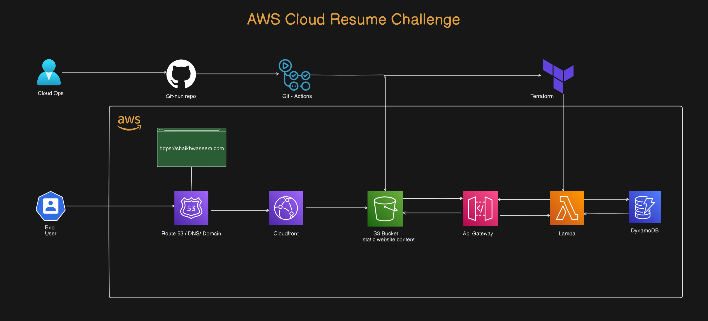

# Cloud-resume-challenge


This project is a version of the popular Cloud Resume Challenge, but with an exciting twist. Here are some differences:
- Instead of manually deploying resources on the AWS Management Console, we will use Infrastructure as Code(IaC). Click [here](https://learn.microsoft.com/en-us/devops/deliver/what-is-infrastructure-as-code) to learn more about IaC.
- We shall use different services. We will use a Lambda function and API Gateway to deliver your resume as a JSON document.
- We create a CI/CD workflow using GitHub Actions.

This project is beginner friendly, and will help you gain hands-on skills in the AWS Cloud Platform. 

## Prerequisites
Here's what you need to complete this project:
- - An AWS [account](https://aws.amazon.com/resources/create-account/)
- - Terraform. Download it [here](https://www.terraform.io/)
- - Terraform Cloud. Create an account [here](https://app.terraform.io/session)

## Architecture Diagram




### How It Works.
- **API Gateway**: Routes requests to the AWS Lambda function.
- **AWS Lambda**: Executes serverless code to fetch resume data from DynamoDB based on the provided ID, and returns it in JSON format.
- **DynamoDB**: A NoSQL database that stores and organizes resume data in a structured format for efficient retrieval by the Lambda function.

## Setup and Deployment.
- ### Use Iac to define your Infrastructure.
  Create terraform files such as ```main.tf``` to define the necessary resources. The services used for this project include a Lambda function, API Gateway and a DynamoDB table.

- ### Deploy with Terraform Cloud.
  Use Terraform Cloud to deploy your resources. Terraform cloud provides an environment for running and managing your terraform configurations.
  Connect your Github to Terraform Cloud to automatically manage your terraform states.
  Add your AWS credentials such as the access key and secret key to Terraform cloud. Remember to flag it as sensitive.
  
- ### Create a CI/CD Pipeline.
  Use GitHub Actions to create a github workflow to automate testing changes you make to your code.

## Summary.
This project demonstrates a serverless architecture for a Resume API using AWS Lambda and DynamoDB. The Lambda function retrieves resume data from DynamoDB and returns it in JSON format. The setup incorporates GitHub Actions for automated deployment and Terraform Cloud for infrastructure management and resource provisioning. 

